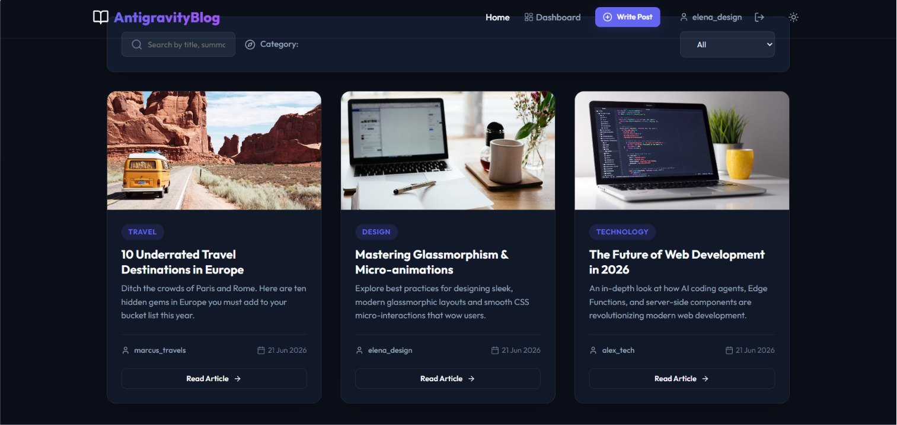
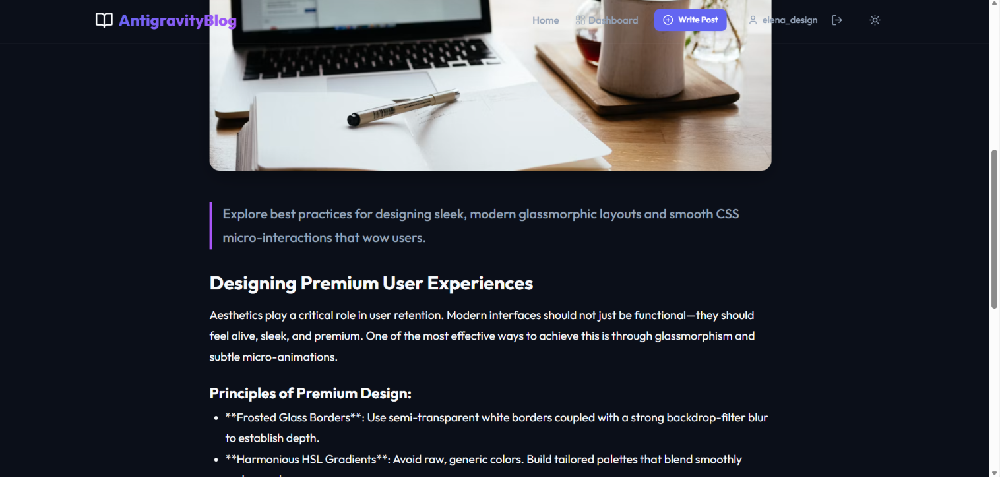
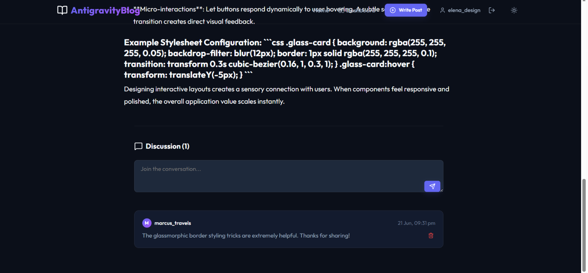
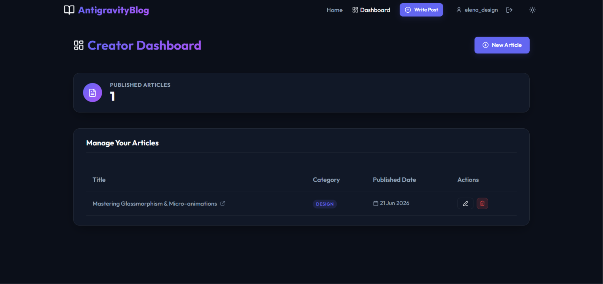
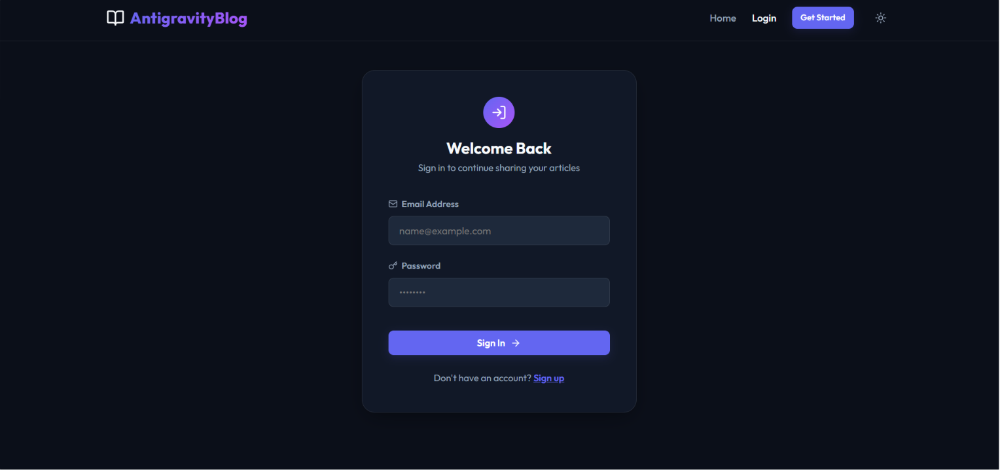

# AntigravityBlog | Premium Full-Stack Blogging Platform with Comments

A premium, full-stack, responsive blogging platform web application. The project features a React frontend client and an Express/Node.js backend server connecting to MongoDB Atlas for article cataloging, customer comments interaction, and user profile management.

[](https://blog-maha9.vercel.app/)
[](https://vite.dev)
[](https://mongodb.com)

---

## 🌐 Live Demo

> The application is locally hosted and accessible at:

**🔗 [AntigravityBlog ](https://blog-maha9.vercel.app/)**

---

## 🚀 Features

- **Premium Glassmorphic Design:** A stunning obsidian dark-mode interface utilizing Google Fonts (`Outfit`), glowing interactive card overlays, and fluid CSS transitions.
- **Dynamic Content Fetch:** Queries article catalog listings in real-time from MongoDB Atlas, supporting keyword search index and category tab filters.
- **Interactive Comment Boards:** Add, view, and manage article discussions with real-time updates and permissions validation checks (only comment author or post author can delete).
- **Personal Creator Dashboard:** Fully managed inventory panel to list user-authored articles, track stats (total articles), and perform quick updates or deletions (CRUD).
- **Session Authentication:** Complete registration and login system with auto-hashed passwords (`bcryptjs`) and JWT session persistence.
- **Root Task Manager:** Concurrently runs both the backend server and frontend client dev servers using a single root command.

---

## 📂 Project Structure

```text
├── client/                 # React frontend application (Vite)
│   ├── public/             # Static assets (HTML, favicons)
│   ├── src/
│   │   ├── components/     # UI Elements (Navbar, PostCard, CommentSection)
│   │   ├── context/        # AuthContext provider
│   │   ├── pages/          # Home, Login, Register, PostDetails, CreateEditPost, Dashboard
│   │   ├── App.jsx         # Application routing container
│   │   ├── index.css       # Core styling & custom HSL variable design system
│   │   └── main.jsx        # App mounting entry script
│   └── package.json        # Client package definitions
│
├── server/                 # Express backend API application
│   ├── config/
│   │   └── db.js           # Mongoose DB connection helper
│   ├── middleware/
│   │   └── auth.js         # JWT authorization guards
│   ├── models/
│   │   ├── User.js         # User schema & password hashing hooks
│   │   ├── Post.js         # Post schema
│   │   └── Comment.js      # Comment schema
│   ├── routes/
│   │   ├── auth.js         # Session registration & profile routes
│   │   ├── posts.js        # Articles lookup & CRUD routes
│   │   └── comments.js     # Comment thread lookup & removal routes
│   ├── scripts/
│   │   ├── seed.js         # MongoDB initial data seeder script
│   │   └── test-auth.js    # Database connection & auth test script
│   ├── .env                # Server configuration secrets
│   ├── index.js            # Express API entry script
│   └── package.json        # Server package definitions
│
├── package.json            # Root manager scripts & concurrently setup
└── README.md               # Project documentation
```

---

## 🛠️ Installation & Setup

Ensure you have [Node.js](https://nodejs.org/) (v18+) installed.

### 1. Configure Environment Variables
Inside the `server/` directory, create a `.env` file and specify your MongoDB Atlas URI:
```env
PORT=5000
MONGO_URI=mongodb+srv://<username>:<password>@cluster.mongodb.net/blog-platform
JWT_SECRET=supersecretjwtkeyforbloggingplatform
```

### 2. Install All Dependencies
Run the installation script in the **root** folder to download npm packages for the root task manager, server, and client folders:
```bash
npm run install-all
```

### 3. Seed Database Data
To populate your MongoDB cluster with default articles, author profiles, and comment boards, run:
```bash
npm run seed
```

---

## 💻 Running the Application

To run the application locally, start both the Express API server and the Vite React client concurrently with a single command from the **root** folder:

```bash
npm run dev
```

### Direct scripts:
- **`npm run dev`**: Starts both client and server concurrently.
- **`npm run install-all`**: Installs packages for root, client, and server folders.
- **`npm run client`**: Starts only the React development server.
- **`npm run server`**: Starts only the Express backend server.

---

## 📸 Screenshots

#### 1. Blog Feed (Articles listing grid, category tabs, and search)


#### 2. Article Details (Full post view and simple Markdown rendering)


#### 3. Comment Section (Nested discussion feeds and author controls)


#### 4. Creator Dashboard (Article metrics table and quick CRUD controls)


#### 5. User Authentication (Glassmorphic login and sign up cards)


---

## 🔒 Security Notice

This application features hashed passwords using **bcryptjs** in the database. When running locally, ensure that your `.env` is kept secure and excluded from version control systems.
